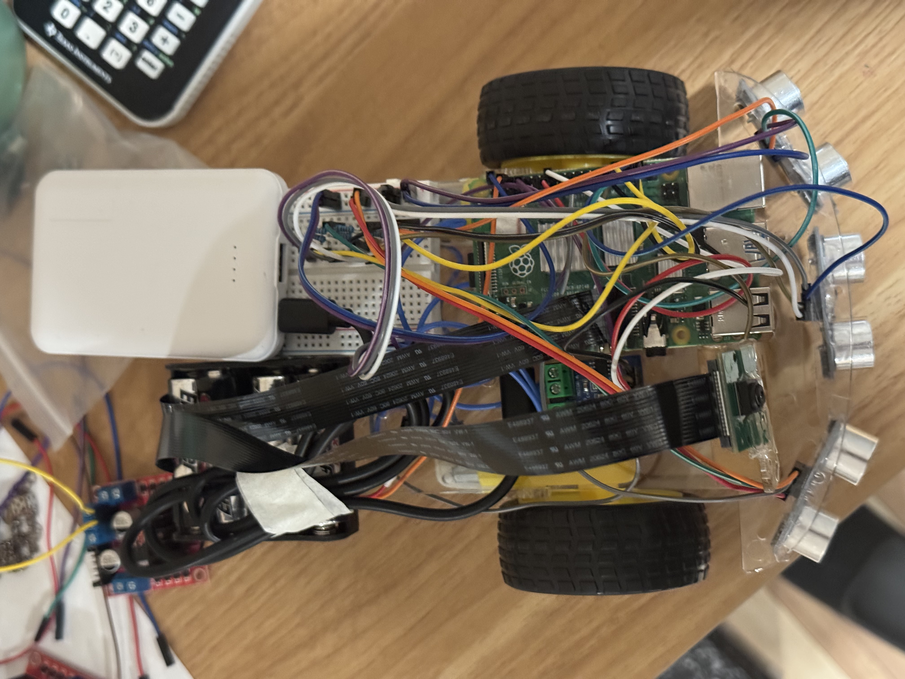
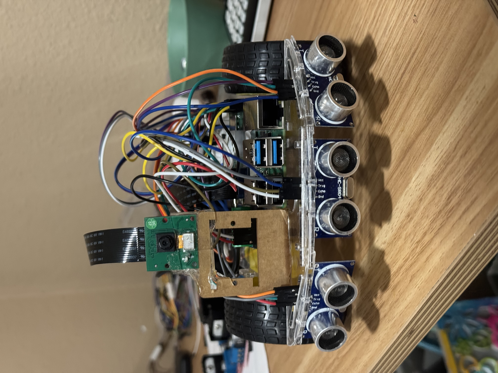
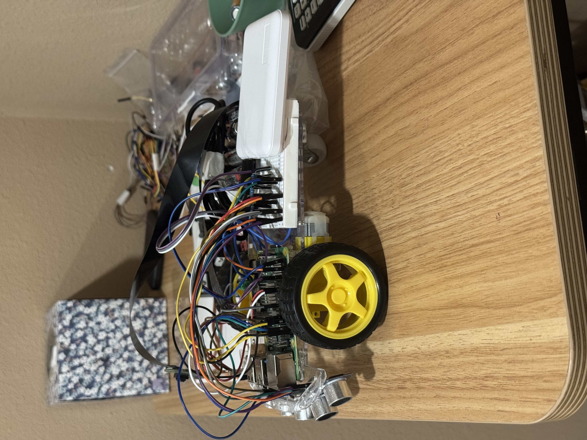

<!-- <!DOCTYPE html> -->
<html lang="en">
<head>
<meta charset="UTF-8">
<meta name="viewport" content="width=device-width, initial-scale=1.0">
<title>Ball Tracking Robot with OpenCV | Vaideesh K</title>
<link rel="preconnect" href="https://fonts.googleapis.com">
<link rel="preconnect" href="https://fonts.gstatic.com" crossorigin>
<link href="https://fonts.googleapis.com/css2?family=Space+Grotesk:wght@400;500;600;700&family=Inter:wght@400;500;600&family=JetBrains+Mono:wght@400;500;700&display=swap" rel="stylesheet">

</head>
<body>

<header class="page-header">
  
 REC · TRACKING · CV_ONLINE

  

    BALL_DETECTED ● conf 0.98
    
    <h1 class="project-name">Ball Tracking Robot with OpenCV</h1>
  

  
Vaideesh K · Computer Vision · Cupertino High School

  

    <a class="btn primary" href="#mods">Modifications</a>
    <a class="btn" href="#final">Final Milestone</a>
    <a class="btn" href="#bom">Bill of Materials</a>
  

</header>

<main class="main">

  
The Ball Tracking Robot with OpenCV uses a Raspberry Pi 4 computer, a 5MP camera, and Python to create a robot that avoids obstacles, moves independently, and makes decisions about where to navigate. This project involves building circuits to make connections, integrating hardware and software, and programming.

  <table>
    <thead><tr><th>Engineer</th><th>School</th><th>Area of Interest</th><th>Grade</th></tr></thead>
    <tbody><tr><td>Vaideesh K</td><td>Cupertino High School</td><td>Electrical Engineering</td><td>Incoming Senior</td></tr></tbody>
  </table>

  

  <!-- ============ MODIFICATIONS ============ -->
  <h1 class="section" id="mods">EXTENSION / POST-FINALModifications</h1>

  
Summary

  
After finishing my final milestone, I went back and upgraded the robot with three big improvements: variable speed control using PWM, a servo that pans the camera to keep the ball centered, and a web dashboard that streams the camera feed live and lets me start and stop the robot from my phone. In the original code the motors were either fully on or fully off, the camera was fixed in place, and I could only see what the robot saw if I was plugged into a monitor. With these modifications the robot now slows down smoothly as it gets close to the ball, physically turns the camera to follow the ball instead of just steering the whole body, and I can control and watch everything from a browser on any device connected to the same network. I also made the ball detection steadier so the tracking is less jumpy.

  
PWM Speed Control

  
In my final milestone the motors only knew two states — full power or off — so the robot moved in jerky bursts. I switched every motor pin over to PWM (Pulse Width Modulation), which rapidly turns the pin on and off to control how much power the motor actually gets, so now I can set any speed from 0 to 100 percent. I use this to make the robot cruise fast when the ball is far away and automatically slow down as it gets closer, so it eases up to the ball instead of slamming into it. The <code class="inl">speed_for()</code> function does this by mapping the distance to a speed: far away returns full cruise speed, close returns the minimum creep speed, and anything in between scales smoothly between the two. I also added an <code class="inl">INSIDE</code> factor to the turn functions so that when turning, the inside wheel spins slower than the outside wheel, which gives a smoother curve instead of a sharp pivot.

  
Servo Camera Panning

  
The biggest change was adding a servo motor under the camera so the camera can physically turn left and right on its own. Before, if the ball moved to the side, the whole robot had to rotate to keep it in view. Now the camera pans to follow the ball while the body stays pointed forward, which makes tracking much smoother. The code figures out how far the ball is from the center of the frame (the "error"), and if that error is bigger than a deadzone, it nudges the servo a small step in that direction to re-center the ball. The deadzone stops the servo from twitching constantly when the ball is basically centered. There is a <code class="inl">SERVO_DIR</code> setting I can flip if the servo turns the wrong way, and min/max limits so it cannot try to turn past its physical range.

  
Web Control Dashboard

  
To make the robot easier to use and to show it off, I added a web interface using Flask. The program runs two things at the same time using threading: one thread is the "brain" that captures frames, detects the ball, reads the sensors, and drives the motors and servo, and the other thread runs a small web server. The web page has a live video feed of what the camera sees, plus START and STOP buttons. The video is streamed as MJPEG, which is basically a fast sequence of JPEG images, and I compress each frame to 60 percent quality so it streams smoothly without lag. Now I can open a browser on my phone, go to the Pi's IP address, and watch and control the robot with no monitor or keyboard plugged in.

  
Steadier Detection

  
I also cleaned up the ball detection. Instead of just using the biggest red blob, the code now scores each candidate by how well it fills a circle (using <code class="inl">minEnclosingCircle</code>) combined with its size, and picks the best one. On top of that I added smoothing so the tracked position is a blend of the old position and the new one (a 60/40 mix), which stops the box from jumping around frame to frame. I also added a "lost hold" so if the ball disappears for a few frames the robot does not instantly give up — it holds the last known position for a short time in case the ball just flickered out.

  
Modified Code — PWM, Servo, and Web Control

  
This is the full upgraded program. It combines the camera, motors, servo, and ultrasonic sensors, adds PWM speed control and servo panning, and serves a live video stream with START/STOP buttons to a web page. All the settings I tune the most are grouped at the top so they are easy to adjust.

  

nano_demo.py

<pre><code>from flask import Flask, Response, render_template_string
from picamera2 import Picamera2
import cv2
import numpy as np
import RPi.GPIO as GPIO
import time
import threading

# ================= TUNING =================
# motors
MIN_SPEED    = 55
CRUISE_SPEED = 100
TURN_SPEED   = 90
AVOID_SPEED  = 85
SLOW_FROM    = 60
ARRIVE_AT    = 15
OBSTACLE_AT  = 20
SIDE_EVERY   = 8

# detection
MIN_AREA   = 400
MIN_RADIUS = 20
MAX_RADIUS = 100
MIN_FILL   = 0.55
LOST_HOLD  = 10

# servo camera pan
SERVO_DIR = -1        # flip to 1 if camera turns away from the ball
SERVO_GAIN = 0.03
SERVO_MAX_STEP = 3
SERVO_DEADZONE = 55
SERVO_MIN = 20
SERVO_MAX = 160

# ================= MOTORS =================
GPIO.setmode(GPIO.BCM)
GPIO.setwarnings(False)
A1A = 6; A1B = 5; B1A = 22; B2A = 23
for p in [A1A, A1B, B1A, B2A]:
    GPIO.setup(p, GPIO.OUT)
pA1A = GPIO.PWM(A1A, 1000); pA1B = GPIO.PWM(A1B, 1000)
pB1A = GPIO.PWM(B1A, 1000); pB2A = GPIO.PWM(B2A, 1000)
for p in [pA1A, pA1B, pB1A, pB2A]:
    p.start(0)

INSIDE = 0.4
def forward(s):
    pA1A.ChangeDutyCycle(0); pA1B.ChangeDutyCycle(s)
    pB1A.ChangeDutyCycle(0); pB2A.ChangeDutyCycle(s)
def left(s):
    pA1A.ChangeDutyCycle(0); pA1B.ChangeDutyCycle(int(s * INSIDE))
    pB1A.ChangeDutyCycle(0); pB2A.ChangeDutyCycle(s)
def right(s):
    pA1A.ChangeDutyCycle(0); pA1B.ChangeDutyCycle(s)
    pB1A.ChangeDutyCycle(0); pB2A.ChangeDutyCycle(int(s * INSIDE))
def stop():
    for p in [pA1A, pA1B, pB1A, pB2A]:
        p.ChangeDutyCycle(0)

# ================= SERVO =================
SERVO = 18
GPIO.setup(SERVO, GPIO.OUT)
servo_pwm = GPIO.PWM(SERVO, 50)
servo_pwm.start(0)
cam_angle = 90.0
def drive_servo(a):
    a = max(SERVO_MIN, min(SERVO_MAX, a))
    duty = 2.5 + (a / 180.0) * 10.0
    servo_pwm.ChangeDutyCycle(duty)
    time.sleep(0.02)
    servo_pwm.ChangeDutyCycle(0)
    return a
cam_angle = drive_servo(cam_angle)

# ================= SENSORS =================
SENSORS = {&quot;LEFT&quot;: (19, 26), &quot;CENTER&quot;: (16, 20), &quot;RIGHT&quot;: (11, 12)}
for trig, echo in SENSORS.values():
    GPIO.setup(trig, GPIO.OUT)
    GPIO.setup(echo, GPIO.IN)
    GPIO.output(trig, False)
def measure(trig, echo):
    start = time.time(); stop_t = time.time()
    GPIO.output(trig, True); time.sleep(0.00001); GPIO.output(trig, False)
    t = time.time() + 0.006
    while GPIO.input(echo) == 0 and time.time() &lt; t: start = time.time()
    t = time.time() + 0.006
    while GPIO.input(echo) == 1 and time.time() &lt; t: stop_t = time.time()
    d = round((stop_t - start) * 34300 / 2, 1)
    return d if 0 &lt; d &lt; 400 else 400

# ================= CAMERA =================
picam2 = Picamera2()
picam2.configure(picam2.create_preview_configuration(
    main={&quot;format&quot;: &quot;RGB888&quot;, &quot;size&quot;: (480, 360)}))
picam2.start()
time.sleep(2)

W = 480
CENTER = W // 2
LEFT_EDGE  = W // 3
RIGHT_EDGE = W * 2 // 3
kernel = np.ones((5, 5), np.uint8)

running = False
latest = None
lock = threading.Lock()
dL = dR = 400
frame_count = 0
sx = None
lost = 0

def speed_for(d):
    if d &gt;= SLOW_FROM: return CRUISE_SPEED
    if d &lt;= ARRIVE_AT: return MIN_SPEED
    frac = (d - ARRIVE_AT) / float(SLOW_FROM - ARRIVE_AT)
    return int(MIN_SPEED + frac * (CRUISE_SPEED - MIN_SPEED))

def brain():
    global latest, dL, dR, frame_count, sx, lost, cam_angle
    while True:
        frame_count += 1
        frame = picam2.capture_array()
        frame = cv2.flip(frame, -1)

        dC = measure(*SENSORS[&quot;CENTER&quot;])
        if frame_count % SIDE_EVERY == 0:
            dL = measure(*SENSORS[&quot;LEFT&quot;])
            dR = measure(*SENSORS[&quot;RIGHT&quot;])

        # ---- DETECTION ----
        blurred = cv2.GaussianBlur(frame, (5, 5), 0)
        hsv = cv2.cvtColor(blurred, cv2.COLOR_BGR2HSV)
        lo1 = np.array([0, 150, 90]);   hi1 = np.array([10, 255, 255])
        lo2 = np.array([170, 150, 90]); hi2 = np.array([180, 255, 255])
        mask = cv2.inRange(hsv, lo1, hi1) + cv2.inRange(hsv, lo2, hi2)
        mask = cv2.morphologyEx(mask, cv2.MORPH_OPEN,  kernel)
        mask = cv2.morphologyEx(mask, cv2.MORPH_CLOSE, kernel, iterations=2)
        mask = cv2.copyMakeBorder(mask, 1, 1, 1, 1, cv2.BORDER_CONSTANT, value=0)

        contours, _ = cv2.findContours(mask, cv2.RETR_EXTERNAL, cv2.CHAIN_APPROX_SIMPLE)
        best = None; best_score = 0
        for c in contours:
            area = cv2.contourArea(c)
            if area &lt; MIN_AREA:
                continue
            (mx, my), mr = cv2.minEnclosingCircle(c)
            if mr &lt; MIN_RADIUS or mr &gt; MAX_RADIUS:
                continue
            fill = area / (np.pi * mr * mr) if mr &gt; 0 else 0
            if fill &lt; MIN_FILL:
                continue
            score = fill * area
            if score &gt; best_score:
                best_score = score
                best = (int(mx), int(my), int(mr))

        # smooth + hold
        if best is not None:
            mx = best[0]
            sx = mx if sx is None else 0.6 * sx + 0.4 * mx
            lost = 0
        else:
            lost += 1
            if lost &gt; LOST_HOLD:
                sx = None

        ball = sx is not None
        pos = &quot;NONE&quot;
        if ball:
            cx = int(sx)
            if cx &lt; LEFT_EDGE:    pos = &quot;LEFT&quot;
            elif cx &gt; RIGHT_EDGE: pos = &quot;RIGHT&quot;
            else:                 pos = &quot;CENTER&quot;
            if best is not None:
                bx, by, br = best
                cv2.circle(frame, (bx, by), br, (0, 255, 0), 3)

            # ---- SERVO: pan camera to keep ball centered ----
            err = cx - CENTER
            if abs(err) &gt; SERVO_DEADZONE:
                stepc = SERVO_DIR * SERVO_GAIN * err
                stepc = max(-SERVO_MAX_STEP, min(SERVO_MAX_STEP, stepc))
                cam_angle = cam_angle + stepc
        cam_angle = drive_servo(cam_angle)

        # ---- DRIVE ----
        if not running:
            stop(); action = &quot;STOPPED&quot;
        elif dL &lt; OBSTACLE_AT and dL &lt; dR:
            right(AVOID_SPEED); action = &quot;avoid&quot;
        elif dR &lt; OBSTACLE_AT:
            left(AVOID_SPEED);  action = &quot;avoid&quot;
        elif ball:
            if 0 &lt; dC &lt;= ARRIVE_AT:
                stop(); action = &quot;ARRIVED&quot;
            elif pos == &quot;LEFT&quot;:
                left(TURN_SPEED);  action = &quot;left&quot;
            elif pos == &quot;RIGHT&quot;:
                right(TURN_SPEED); action = &quot;right&quot;
            else:
                s = speed_for(dC)
                forward(s); action = f&quot;fwd {s}%&quot;
        else:
            stop(); action = &quot;no ball&quot;

        cv2.line(frame, (LEFT_EDGE, 0),  (LEFT_EDGE, 360),  (80, 80, 80), 1)
        cv2.line(frame, (RIGHT_EDGE, 0), (RIGHT_EDGE, 360), (80, 80, 80), 1)
        cv2.putText(frame, f&quot;{pos} | {action}&quot;, (10, 30),
                    cv2.FONT_HERSHEY_SIMPLEX, 0.7, (0, 255, 0), 2)
        cv2.putText(frame, f&quot;C{dC}  cam={int(cam_angle)}&quot;, (10, 60),
                    cv2.FONT_HERSHEY_SIMPLEX, 0.6, (0, 255, 0), 2)

        ok, jpg = cv2.imencode(&#x27;.jpg&#x27;, frame, [int(cv2.IMWRITE_JPEG_QUALITY), 60])
        if ok:
            with lock:
                latest = jpg.tobytes()

threading.Thread(target=brain, daemon=True).start()

app = Flask(__name__)
PAGE = &quot;&quot;&quot;
&lt;html&gt;&lt;head&gt;&lt;title&gt;Ball Tracking Robot&lt;/title&gt;
&lt;style&gt;
 body{background:#111;color:#eee;font-family:sans-serif;text-align:center}
 img{border:3px solid #444;border-radius:8px;margin-top:15px;width:90%;max-width:600px}
 button{font-size:20px;padding:14px 34px;margin:10px;border:none;border-radius:6px;cursor:pointer}
 .go{background:#2a7;color:#fff} .no{background:#a33;color:#fff}
&lt;/style&gt;&lt;/head&gt;
&lt;body&gt;
 &lt;h1&gt;Ball Tracking Robot&lt;/h1&gt;
 &lt;button class=&quot;go&quot; onclick=&quot;fetch(&#x27;/start&#x27;)&quot;&gt;START&lt;/button&gt;
 &lt;button class=&quot;no&quot; onclick=&quot;fetch(&#x27;/stop&#x27;)&quot;&gt;STOP&lt;/button&gt;
 &lt;br&gt;&lt;img src=&quot;/video&quot;&gt;
&lt;/body&gt;&lt;/html&gt;
&quot;&quot;&quot;

def gen():
    while True:
        with lock:
            d = latest
        if d is None:
            time.sleep(0.03); continue
        yield (b&#x27;--frame\r\nContent-Type: image/jpeg\r\n\r\n&#x27; + d + b&#x27;\r\n&#x27;)
        time.sleep(0.03)

@app.route(&#x27;/&#x27;)
def index(): return render_template_string(PAGE)

@app.route(&#x27;/start&#x27;)
def go():
    global running; running = True; return &quot;started&quot;

@app.route(&#x27;/stop&#x27;)
def halt():
    global running; running = False; stop(); return &quot;stopped&quot;

@app.route(&#x27;/video&#x27;)
def video():
    return Response(gen(), mimetype=&#x27;multipart/x-mixed-replace; boundary=frame&#x27;)

try:
    app.run(host=&#x27;0.0.0.0&#x27;, port=5000, threaded=True)
finally:
    stop(); servo_pwm.stop(); GPIO.cleanup()</code></pre>

  <!-- ============ FINAL MILESTONE ============ -->
  <h1 class="section" id="final">MILESTONE 03 / FINALFinal Milestone</h1>
  
<iframe src="https://www.youtube.com/embed/IsikH-t7laU" title="Vaideesh K. Milestone 3" allow="accelerometer; autoplay; clipboard-write; encrypted-media; gyroscope; picture-in-picture; web-share" referrerpolicy="strict-origin-when-cross-origin" allowfullscreen></iframe>

  
Summary

  
My third and final milestone is the last portion of my project. In this part I installed a 5MP Raspberry Pi Camera and used OpenCV to run the vision code. The finished robot combines the three ultrasonic sensors, the L9110 motor driver, and the two motors so that it can detect and follow a red ball while using the three ultrasonic sensors to measure the distance to objects on the left, center, and right, and to detect and avoid obstacles in real time. The camera sees the ball and decides whether it is on the left, center, or right, and the robot turns or drives forward to follow it, stopping when it gets close. To make sure the robot only follows the ball and not any other red object, I added a circularity check that measures how round each red object is, so only round objects like the ball are tracked.

  
Challenges

  
A major challenge I faced was getting the camera to be detected by the Raspberry Pi 4 Model B. I ran <code class="inl">rpicam-hello</code> to turn on the camera and check for a live preview, but it did not work. My next step was to completely power down the Pi by unplugging the USB-C cable and reseating the camera ribbon cable at both the camera module and the connector on the Raspberry Pi. I rebooted and ran it again, but it still did not work, so I tried three different cameras of the same model with different ribbon cables. I ran <code class="inl">rpicam-hello --list-cameras</code> to see if anything would show up, but no cameras were available. I then ran an update to see if that would fix the issue, but nothing changed. As a last resort I created a camera test — I made a file, wrote the camera code, saved it, and ran it, and it finally worked.

  
Another challenge was making the robot track only the red ball and not every red object in the room. At first the code just picked the largest red blob, so it would follow red shirts or anything else red. I fixed this by adding a circularity calculation that compares each object's area to its perimeter to measure how round it is. I also had to clean up the mask with morphological operations, because glare on the ball punched holes in the detected shape and ruined the roundness math. I also had to fix the camera orientation, since the image was coming in upside down.

  
Camera Test Code

  
This is the camera test I used to confirm the camera was working with OpenCV. It grabs frames from the Pi Camera using picamera2 and displays them in a live window. Getting this to run was the fix that finally got my camera working after it wouldn't show a preview.

  

camera_test.py

<pre><code>from picamera2 import Picamera2
import cv2

picam2 = Picamera2()
config = picam2.create_preview_configuration(main={&quot;format&quot;: &quot;RGB888&quot;, &quot;size&quot;: (320, 240)})
picam2.configure(config)
picam2.start()

print(&quot;Camera running - press q in the window to quit&quot;)
while True:
    frame = picam2.capture_array()
    cv2.imshow(&quot;Camera&quot;, frame)
    if cv2.waitKey(1) &amp; 0xFF == ord(&#x27;q&#x27;):
        break

cv2.destroyAllWindows()
picam2.stop()</code></pre>

  
Ball Detection Code

  
After the camera worked, I wrote this code to detect the red ball. It converts each frame to HSV, filters for red, cleans up the mask so glare doesn't break the shape, and then calculates the circularity of each red object. Only round objects count as the ball, so other red objects get ignored. The code draws a green box when it finds the ball and prints whether the ball is on the left, center, or right.

  

ball_detection.py

<pre><code>from picamera2 import Picamera2
import cv2
import numpy as np

picam2 = Picamera2()
config = picam2.create_preview_configuration(main={&quot;format&quot;: &quot;RGB888&quot;, &quot;size&quot;: (320, 240)})
picam2.configure(config)
picam2.start()

kernel = np.ones((5, 5), np.uint8)

# Roundness threshold - raise it if it tracks non-ball red objects,
# lower it if it misses the ball
MIN_CIRCULARITY = 0.4

print(&quot;Detecting red ball - press q to quit&quot;)
while True:
    frame = picam2.capture_array()
    frame = cv2.flip(frame, -1)

    blurred = cv2.GaussianBlur(frame, (5, 5), 0)
    hsv = cv2.cvtColor(blurred, cv2.COLOR_BGR2HSV)

    lower1 = np.array([0, 150, 80])
    upper1 = np.array([10, 255, 255])
    lower2 = np.array([170, 150, 80])
    upper2 = np.array([180, 255, 255])
    mask = cv2.inRange(hsv, lower1, upper1) + cv2.inRange(hsv, lower2, upper2)

    # Clean the mask - glare punches holes in the ball and wrecks the
    # perimeter math, so closing fills them back in
    mask = cv2.morphologyEx(mask, cv2.MORPH_OPEN, kernel)
    mask = cv2.morphologyEx(mask, cv2.MORPH_CLOSE, kernel, iterations=3)
    mask = cv2.dilate(mask, kernel, iterations=1)

    contours, _ = cv2.findContours(mask, cv2.RETR_EXTERNAL, cv2.CHAIN_APPROX_SIMPLE)

    best = None
    best_area = 0
    fallback = None
    fallback_area = 0

    for c in contours:
        area = cv2.contourArea(c)
        if area &lt; 300:
            continue

        perimeter = cv2.arcLength(c, True)
        if perimeter == 0:
            continue
        circularity = 4 * np.pi * area / (perimeter * perimeter)

        # Track the biggest round one
        if circularity &gt;= MIN_CIRCULARITY and area &gt; best_area:
            best = (c, circularity)
            best_area = area

        # Also track the biggest blob overall, in case nothing is round
        if area &gt; fallback_area:
            fallback = (c, circularity)
            fallback_area = area

    chosen = best if best is not None else fallback

    if chosen is not None:
        c, circ = chosen
        area = cv2.contourArea(c)
        x, y, w, h = cv2.boundingRect(c)
        cx = x + w // 2

        # Green box = passed roundness (it&#x27;s the ball)
        # Red box = failed roundness (probably not the ball)
        color = (0, 255, 0) if circ &gt;= MIN_CIRCULARITY else (0, 0, 255)
        cv2.rectangle(frame, (x, y), (x+w, y+h), color, 2)

        if cx &lt; 107:
            pos = &quot;LEFT&quot;
        elif cx &gt; 213:
            pos = &quot;RIGHT&quot;
        else:
            pos = &quot;CENTER&quot;

        label = f&quot;{pos}  circ={circ:.2f}&quot;
        cv2.putText(frame, label, (10, 30), cv2.FONT_HERSHEY_SIMPLEX, 0.7, color, 2)
        print(f&quot;Ball: {pos}  area: {int(area)}  circularity: {circ:.2f}&quot;)

    cv2.imshow(&quot;Ball Tracking&quot;, frame)

    if cv2.waitKey(1) &amp; 0xFF == ord(&#x27;q&#x27;):
        break

cv2.destroyAllWindows()
picam2.stop()</code></pre>

  
Final Code — Full Ball Tracking Robot

  
This is the complete program that combines the camera, the motors, and the ultrasonic sensors. The camera detects the red ball, checks that it is round so other red objects are ignored, and decides if the ball is on the left, center, or right. Based on that, the robot turns or drives forward to follow the ball, and the center ultrasonic sensor stops the robot when it gets close so it does not crash into the ball.

  

ball_tracking_robot.py

<pre><code>from picamera2 import Picamera2
import cv2
import numpy as np
import RPi.GPIO as GPIO
import time

# ---------- MOTOR SETUP ----------
GPIO.setmode(GPIO.BCM)
GPIO.setwarnings(False)

A1A = 6; A1B = 5; B1A = 22; B2A = 23
for p in [A1A, A1B, B1A, B2A]:
    GPIO.setup(p, GPIO.OUT)

def forward():
    GPIO.output(A1A, GPIO.LOW); GPIO.output(A1B, GPIO.HIGH)
    GPIO.output(B1A, GPIO.LOW); GPIO.output(B2A, GPIO.HIGH)
def backward():
    GPIO.output(A1A, GPIO.HIGH); GPIO.output(A1B, GPIO.LOW)
    GPIO.output(B1A, GPIO.HIGH); GPIO.output(B2A, GPIO.LOW)
def left():
    GPIO.output(A1A, GPIO.LOW); GPIO.output(A1B, GPIO.LOW)
    GPIO.output(B1A, GPIO.LOW); GPIO.output(B2A, GPIO.HIGH)
def right():
    GPIO.output(A1A, GPIO.LOW); GPIO.output(A1B, GPIO.HIGH)
    GPIO.output(B1A, GPIO.LOW); GPIO.output(B2A, GPIO.LOW)
def stop():
    for p in [A1A, A1B, B1A, B2A]: GPIO.output(p, GPIO.LOW)

# ---------- SENSOR SETUP ----------
sensors = [(&quot;LEFT&quot;, 19, 26), (&quot;CENTER&quot;, 16, 20), (&quot;RIGHT&quot;, 11, 12)]
for name, trig, echo in sensors:
    GPIO.setup(trig, GPIO.OUT)
    GPIO.setup(echo, GPIO.IN)
    GPIO.output(trig, False)

def measure(trig, echo):
    start = time.time()
    stop_t = time.time()
    GPIO.output(trig, True)
    time.sleep(0.00001)
    GPIO.output(trig, False)
    t = time.time() + 0.05
    while GPIO.input(echo) == 0 and time.time() &lt; t:
        start = time.time()
    t = time.time() + 0.05
    while GPIO.input(echo) == 1 and time.time() &lt; t:
        stop_t = time.time()
    return round((stop_t - start) * 34300 / 2, 1)

# ---------- CAMERA SETUP ----------
picam2 = Picamera2()
config = picam2.create_preview_configuration(main={&quot;format&quot;: &quot;RGB888&quot;, &quot;size&quot;: (320, 240)})
picam2.configure(config)
picam2.start()
time.sleep(2)

kernel = np.ones((5, 5), np.uint8)

# Roundness threshold - raise it if it tracks non-ball red objects,
# lower it if it misses the ball
MIN_CIRCULARITY = 0.4

print(&quot;Ball tracking robot running - press q to quit&quot;)

try:
    while True:
        frame = picam2.capture_array()
        frame = cv2.flip(frame, -1)

        blurred = cv2.GaussianBlur(frame, (5, 5), 0)
        hsv = cv2.cvtColor(blurred, cv2.COLOR_BGR2HSV)

        lower1 = np.array([0, 150, 80])
        upper1 = np.array([10, 255, 255])
        lower2 = np.array([170, 150, 80])
        upper2 = np.array([180, 255, 255])
        mask = cv2.inRange(hsv, lower1, upper1) + cv2.inRange(hsv, lower2, upper2)

        # Clean the mask - fills glare holes so the roundness math works
        mask = cv2.morphologyEx(mask, cv2.MORPH_OPEN, kernel)
        mask = cv2.morphologyEx(mask, cv2.MORPH_CLOSE, kernel, iterations=3)
        mask = cv2.dilate(mask, kernel, iterations=1)

        center_dist = measure(16, 20)

        contours, _ = cv2.findContours(mask, cv2.RETR_EXTERNAL, cv2.CHAIN_APPROX_SIMPLE)

        # Find the biggest ROUND red blob (the ball)
        best = None
        best_area = 0
        fallback = None
        fallback_area = 0

        for c in contours:
            area = cv2.contourArea(c)
            if area &lt; 300:
                continue
            perimeter = cv2.arcLength(c, True)
            if perimeter == 0:
                continue
            circularity = 4 * np.pi * area / (perimeter * perimeter)

            if circularity &gt;= MIN_CIRCULARITY and area &gt; best_area:
                best = (c, circularity)
                best_area = area

            if area &gt; fallback_area:
                fallback = (c, circularity)
                fallback_area = area

        chosen = best if best is not None else fallback

        ball_found = False
        pos = &quot;NONE&quot;
        circ = 0.0

        if chosen is not None:
            c, circ = chosen
            # Only treat it as the ball if it passed the roundness test
            if circ &gt;= MIN_CIRCULARITY:
                ball_found = True

            area = cv2.contourArea(c)
            x, y, w, h = cv2.boundingRect(c)
            cx = x + w // 2

            # Green box = it&#x27;s the ball. Red box = red thing, not round enough.
            color = (0, 255, 0) if ball_found else (0, 0, 255)
            cv2.rectangle(frame, (x, y), (x+w, y+h), color, 2)

            if cx &lt; 107:
                pos = &quot;LEFT&quot;
            elif cx &gt; 213:
                pos = &quot;RIGHT&quot;
            else:
                pos = &quot;CENTER&quot;

        # ---------- DECISION LOGIC ----------
        if ball_found:
            if 0 &lt; center_dist &lt; 15:
                stop()
                action = &quot;ARRIVED - stopped&quot;
            elif pos == &quot;LEFT&quot;:
                left()
                action = &quot;turning left&quot;
            elif pos == &quot;RIGHT&quot;:
                right()
                action = &quot;turning right&quot;
            else:
                forward()
                action = &quot;driving forward&quot;
        else:
            stop()
            action = &quot;searching (no ball)&quot;

        cv2.putText(frame, f&quot;{pos} | {action}&quot;, (10, 30),
                    cv2.FONT_HERSHEY_SIMPLEX, 0.6, (0, 255, 0), 2)
        cv2.putText(frame, f&quot;dist: {center_dist} cm  circ: {circ:.2f}&quot;, (10, 60),
                    cv2.FONT_HERSHEY_SIMPLEX, 0.6, (0, 255, 0), 2)
        cv2.imshow(&quot;Ball Tracking Robot&quot;, frame)

        print(f&quot;Ball: {pos} | {action} | dist: {center_dist} cm | circ: {circ:.2f}&quot;)

        if cv2.waitKey(1) &amp; 0xFF == ord(&#x27;q&#x27;):
            break

except KeyboardInterrupt:
    pass

stop()
cv2.destroyAllWindows()
picam2.stop()
GPIO.cleanup()
print(&quot;Stopped and cleaned up&quot;)</code></pre>

  <!-- ============ SECOND MILESTONE ============ -->
  <h1 class="section" id="m2">MILESTONE 02Second Milestone</h1>
  
<iframe src="https://www.youtube.com/embed/lQya6fe888A" title="Vaideesh K. Milestone 2" allow="accelerometer; autoplay; clipboard-write; encrypted-media; gyroscope; picture-in-picture; web-share" allowfullscreen></iframe>

  
Summary

  
My second milestone was the biggest portion of my project. I had to get the motors spinning, which in turn makes the wheels spin, and I had to get all three ultrasonic sensors working. I wrote code for both — the motor code drives the robot forward, backward, left, and right, and the sensor code uses the Pi to send a signal to the Trigger pin, releasing a burst of ultrasonic sound at approximately 40,000 Hz. The sound travels out, hits an object, and bounces back, and the time it takes to return is used to calculate the distance.

  
Challenges

  
The biggest challenge I faced was getting the motors running. I tried four different L298N motor driver boards because the first one arrived defective — it was missing all of its screw terminals and had pads that were already soldered shut, which made it very difficult to connect the battery and motor wires reliably and safely.

  
The problem that took about two weeks to solve was supplying power to the motors. The board would not power on through the +12V input while I was using the L298N. I tried 6V, 7.5V, and 9V battery packs, and nothing worked. I had to systematically test each part — the battery holder, the batteries, the motors, the Pi, and the wiring — to isolate exactly where the problem was.

  
Another issue was unreliable connections, which was the hardest part because everything <em>looked</em> correct, but I eventually realized some wires weren't making solid contact with the Raspberry Pi or the breadboard. I was also missing a few connections because I was progressing too quickly.

  
After all of these problems, there was one simple fix that would have saved a lot of time: switching to the L9110 motor driver. The L9110 uses a single power input instead of separate logic and motor inputs, which makes everything much simpler — and once I switched, the motors finally spun.

  
Motor Driver Code

  
This code uses basic WASD controls to move the robot, which is useful for testing the most basic mechanics of the motors. It also confirms that the wiring to the motor driver and the Raspberry Pi is correct. The HIGH/LOW combinations create different patterns, which cause the changes in direction.

  

motor_test.py

<pre><code>import RPi.GPIO as GPIO
GPIO.setmode(GPIO.BCM)

A1A = 6; A1B = 5; B1A = 22; B2A = 23
for p in [A1A, A1B, B1A, B2A]:
    GPIO.setup(p, GPIO.OUT)

def forward():
    GPIO.output(A1A, GPIO.LOW); GPIO.output(A1B, GPIO.HIGH)
    GPIO.output(B1A, GPIO.LOW); GPIO.output(B2A, GPIO.HIGH)
def backward():
    GPIO.output(A1A, GPIO.HIGH); GPIO.output(A1B, GPIO.LOW)
    GPIO.output(B1A, GPIO.HIGH); GPIO.output(B2A, GPIO.LOW)
def left():
    GPIO.output(A1A, GPIO.LOW); GPIO.output(A1B, GPIO.LOW)
    GPIO.output(B1A, GPIO.LOW); GPIO.output(B2A, GPIO.HIGH)
def right():
    GPIO.output(A1A, GPIO.LOW); GPIO.output(A1B, GPIO.HIGH)
    GPIO.output(B1A, GPIO.LOW); GPIO.output(B2A, GPIO.LOW)
def stop():
    for p in [A1A, A1B, B1A, B2A]: GPIO.output(p, GPIO.LOW)

print(&quot;w=forward s=back a=left d=right x=stop q=quit&quot;)
try:
    while True:
        u = input(&quot;move: &quot;)
        if u == &#x27;w&#x27;: forward()
        elif u == &#x27;s&#x27;: backward()
        elif u == &#x27;a&#x27;: left()
        elif u == &#x27;d&#x27;: right()
        elif u == &#x27;x&#x27;: stop()
        elif u == &#x27;q&#x27;: break
except KeyboardInterrupt:
    pass
GPIO.cleanup()</code></pre>

  
Ultrasonic Sensor Code

  
This code tests whether the ultrasonic sensors work. It measures the distance to an object by firing a pulse from each sensor, timing how long the echo takes to return, and using the speed of sound to calculate the distance. It reads all three sensors — left, center, and right — and prints their distances.

  

ultrasonic_test.py

<pre><code>import RPi.GPIO as GPIO
import time
GPIO.setmode(GPIO.BCM)
GPIO.setwarnings(False)

# All 3 sensors: (name, TRIG, ECHO)
sensors = [
    (&quot;LEFT&quot;,   19, 26),
    (&quot;CENTER&quot;, 16, 20),
    (&quot;RIGHT&quot;,  11, 12),
]

for name, trig, echo in sensors:
    GPIO.setup(trig, GPIO.OUT)
    GPIO.setup(echo, GPIO.IN)
    GPIO.output(trig, False)

time.sleep(2)

def measure(trig, echo):
    start = time.time()
    stop = time.time()
    GPIO.output(trig, True)
    time.sleep(0.00001)
    GPIO.output(trig, False)
    timeout = time.time() + 0.05
    while GPIO.input(echo) == 0 and time.time() &lt; timeout:
        start = time.time()
    timeout = time.time() + 0.05
    while GPIO.input(echo) == 1 and time.time() &lt; timeout:
        stop = time.time()
    return round((stop - start) * 34300 / 2, 1)

try:
    while True:
        for name, trig, echo in sensors:
            d = measure(trig, echo)
            print(name, &quot;:&quot;, d, &quot;cm&quot;)
        print(&quot;-----&quot;)
        time.sleep(0.5)
except KeyboardInterrupt:
    GPIO.cleanup()</code></pre>

  
What's Next

  
Connect the camera to the Raspberry Pi and add code so it can track the ball. I will write the OpenCV code so the robot can detect the red ball, then combine the camera, sensors, and motors so it can track the ball and avoid obstacles in its path.

  <!-- ============ FIRST MILESTONE ============ -->
  <h1 class="section" id="m1">MILESTONE 01First Milestone</h1>
  
<iframe src="https://www.youtube.com/embed/zEN702sMDmo" title="Vaideesh K. Milestone 1" allow="accelerometer; autoplay; clipboard-write; encrypted-media; gyroscope; picture-in-picture; web-share" allowfullscreen></iframe>

  
Summary

  
The goal of the first milestone was to build the foundation of the ball-tracking robot: assembling the robot chassis, getting the Raspberry Pi running with the necessary software installed, and completing all of the electronic connections (wiring the two motors to the L9110 motor driver, the three ultrasonic sensors, and the power). The Pi drives the motors, and the camera is added so the robot can track the red ball and follow it.

  
Components Used

  <ul>
    <li><strong>Raspberry Pi 4 Model B</strong> — the brain behind everything. It runs the code and controls the robot, from the sensors to the motors.</li>
    <li><strong>PiCamera (OV5647)</strong> — the camera that detects the ball (used in later milestones).</li>
    <li><strong>L9110 Motor Driver</strong> — an H-bridge board that lets the Pi control the motors. I switched to this after using the L298N.</li>
    <li><strong>2× Yellow TT Motors</strong> — spin the wheels to move the robot.</li>
    <li><strong>2× Wheels + Front Caster</strong> — the wheels drive the robot, and the caster helps balance it and mount the front sensors.</li>
    <li><strong>3× HC-SR04 Ultrasonic Sensors</strong> — measure distance for obstacle detection.</li>
    <li><strong>Resistors (1kΩ and 2kΩ)</strong> — build the voltage dividers that protect the Pi's 3.3V pins from the sensors' 5V signals.</li>
    <li><strong>Breadboard</strong> — the main hub for connecting the voltage dividers, power, and sensor wiring.</li>
    <li><strong>Jumper Wires</strong> — connect all the components together.</li>
    <li><strong>4×AA Battery Pack (6V)</strong> — powers the motors.</li>
    <li><strong>USB-C Powerbank</strong> — powers the Pi.</li>
    <li><strong>Clear Acrylic 2WD Chassis</strong> — the frame that holds everything together.</li>
  </ul>

  
Challenges

  
The challenges I faced were finding diagrams to help me make the electrical connections and making all of the connections myself. There were nearly 40 connections to make, and the wires kept getting tangled, the resistors kept getting unplugged, and everything was disorganized. I had to reseat and redo cables multiple times, but in the end I got them organized. I also ran into a problem where some cables were dead, so I used a multimeter to find and replace them.

  
What's Next

  
Make the motors work when connected to the motor driver, and make the ultrasonic sensors detect the distance of an object placed in front of them.

  <!-- ============ SCHEMATICS ============ -->
  <h1 class="section" id="schematics">REFERENCESchematics</h1>
  
Ball Tracking Robot Diagram

  
  
Robot Build Photos

  

    
    
    
  

  <!-- ============ BILL OF MATERIALS ============ -->
  <h1 class="section" id="bom">REFERENCEBill of Materials</h1>
  <table>
    <thead><tr><th>Part</th><th>Note</th><th>Price</th><th>Link</th></tr></thead>
    <tbody>
      <tr><td>Raspberry Pi 4 Model B</td><td>Small computer used for controlling the robot and writing code</td><td>$79.97</td><td><a href="https://www.amazon.com/Raspberry-Model-2019-Quad-Bluetooth/dp/B07TC2BK1X">Link</a></td></tr>
      <tr><td>Raspberry Pi Camera Module</td><td>Camera used for live video and seeing the ball</td><td>$14.99</td><td><a href="https://www.amazon.com/Arducam-Autofocus-Raspberry-Motorized-Software/dp/B07SN8GYGD">Link</a></td></tr>
      <tr><td>L298N Driver Board</td><td>A basic motor driver used to drive the wheels forward and backward</td><td>$8.99</td><td><a href="https://www.amazon.com/Qunqi-2Packs-Controller-Stepper-Arduino/dp/B01M29YK5U">Link</a></td></tr>
      <tr><td>Motors and Board Kit</td><td>Basic hardware pieces that help with the assembly of the robot</td><td>$13.59</td><td><a href="https://www.amazon.com/Smart-Chassis-Motors-Encoder-Battery/dp/B01LXY7CM3">Link</a></td></tr>
      <tr><td>Powerbank</td><td>Supplies power to the Raspberry Pi 4</td><td>$21.98</td><td><a href="https://www.amazon.com/Anker-Ultra-Compact-High-Speed-VoltageBoost-Technology/dp/B07QXV6N1B">Link</a></td></tr>
      <tr><td>HC-SR04 Sensors (5 pcs)</td><td>Used for distance calculations of objects and obstacles</td><td>$8.99</td><td><a href="https://www.amazon.com/Organizer-Ultrasonic-Distance-MEGA2560-ElecRight/dp/B07RGB4W8V">Link</a></td></tr>
      <tr><td>HDMI to Micro HDMI Cable</td><td>Connects the Raspberry Pi 4 to a laptop for the OBS video stream</td><td>$8.99</td><td><a href="https://www.amazon.com/UGREEN-Adapter-Ethernet-Compatible-Raspberry/dp/B06WWQ7KLV">Link</a></td></tr>
      <tr><td>Video Capture Card</td><td>Necessary to display the Pi's output on laptops</td><td>$16.99</td><td><a href="https://www.amazon.com/Capture-Streaming-Broadcasting-Conference-Teaching/dp/B09FLN63B3">Link</a></td></tr>
      <tr><td>SD Card Reader</td><td>Necessary to flash the microSD card and install an OS</td><td>$4.99</td><td><a href="https://www.amazon.com/Reader-Adapter-Camera-Memory-Wansurs/dp/B0B9QZ4W4Y">Link</a></td></tr>
      <tr><td>Wired Mouse and Keyboard</td><td>Needed to operate the Raspberry Pi 4</td><td>$25.99</td><td><a href="https://www.amazon.com/Wireless-Keyboard-Trueque-Cordless-Computer/dp/B09J4RQFK7">Link</a></td></tr>
      <tr><td>Basic Connections Components Kit</td><td>Includes male-to-male, female-to-female, and male-to-female jumper wires, resistors, and LEDs</td><td>$11.47</td><td><a href="https://www.amazon.com/Smraza-Breadboard-Resistors-Mega2560-Raspberry/dp/B01HRR7EBG">Link</a></td></tr>
      <tr><td>Soldering Kit</td><td>Used for the motor connections</td><td>$13.60</td><td><a href="https://www.amazon.com/Soldering-Interchangeable-Adjustable-Temperature-Enthusiast/dp/B087767KNW">Link</a></td></tr>
    </tbody>
  </table>

  <!-- ============ STARTER PROJECT ============ -->
  <h1 class="section" id="starter">STARTER PROJECTRetro Arcade</h1>
  
<iframe src="https://www.youtube.com/embed/BF2v-AP0EPY" title="Retro Arcade Starter Project" allow="accelerometer; autoplay; clipboard-write; encrypted-media; gyroscope; picture-in-picture; web-share" allowfullscreen></iframe>

  
Summary

  
My starter project was the Retro Arcade Console. It works by receiving input from the buttons on the front display, which is processed through the integrated circuits and displayed on an LCD screen. It also includes a buzzer for sound effects and runs on batteries. After I soldered all of the electronic components onto the circuit board, I could play games like Tetris and Snake, with the system keeping track of the player's score. This project taught me how to solder electronics to circuit boards, identify electronic components, and troubleshoot electrical connections. Building the Retro Arcade Console helped prepare me for my main project, the Ball Tracking Robot.

  
Components Used

  <ul>
    <li>Microcontroller</li>
    <li>Small LCD Screen</li>
    <li>Buzzer</li>
    <li>Capacitors</li>
    <li>4×AA Battery Holder / AA Batteries</li>
    <li>PCB (Circuit Board)</li>
    <li>Solder Kit</li>
    <li>Header Pins</li>
    <li>Acrylic Case</li>
    <li>Variety of Colored Buttons</li>
  </ul>

  
Challenges Faced

  
There were several challenges, some harder than others. My first challenge was soldering the board — every time I soldered, the solder kept bridging to other holes, which could cause a short circuit and damage the board. Another problem was getting the red and black battery wires to sit neatly in two tiny holes and holding them in place so I could solder them properly. I had to unsolder many parts multiple times because the console simply would not turn on. But after all of these hardships, I managed to fix every one of them and get the console working properly.

  
// Vaideesh K · Ball Tracking Robot with OpenCV · Cupertino High School

</main>
</body>
</html>
